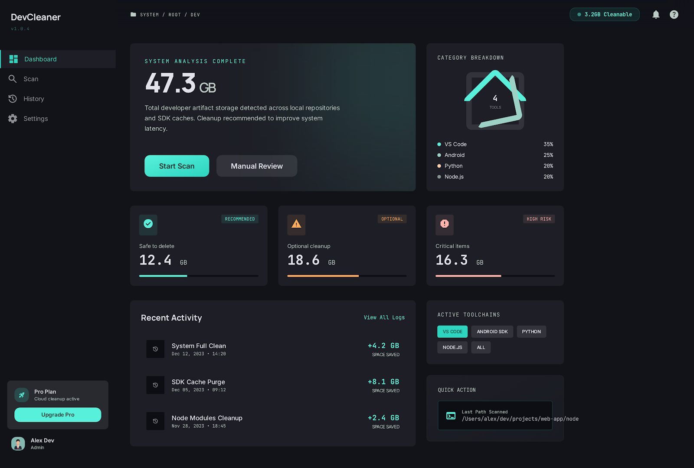
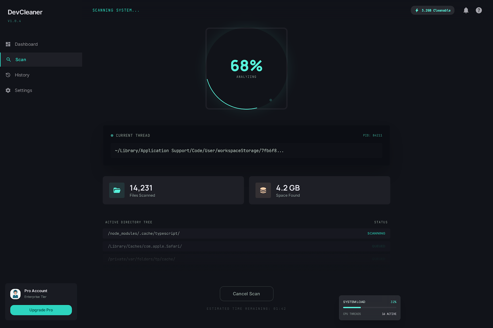
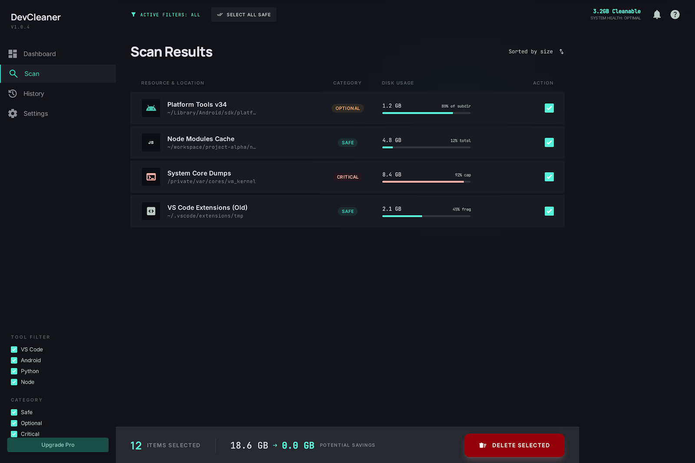
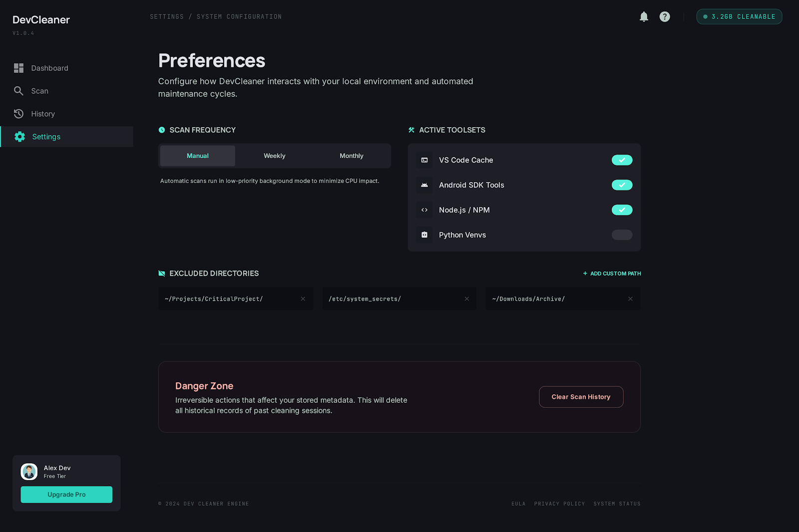
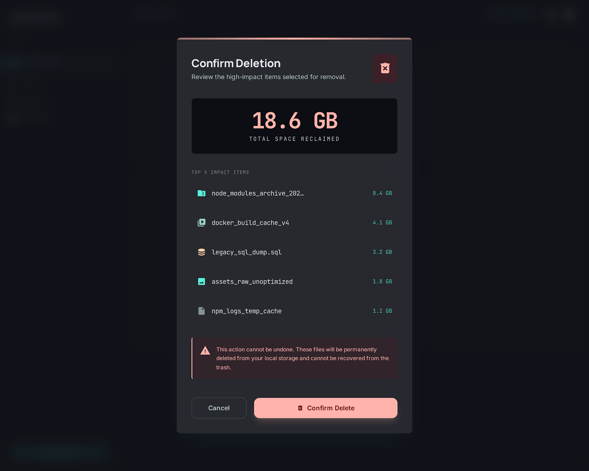
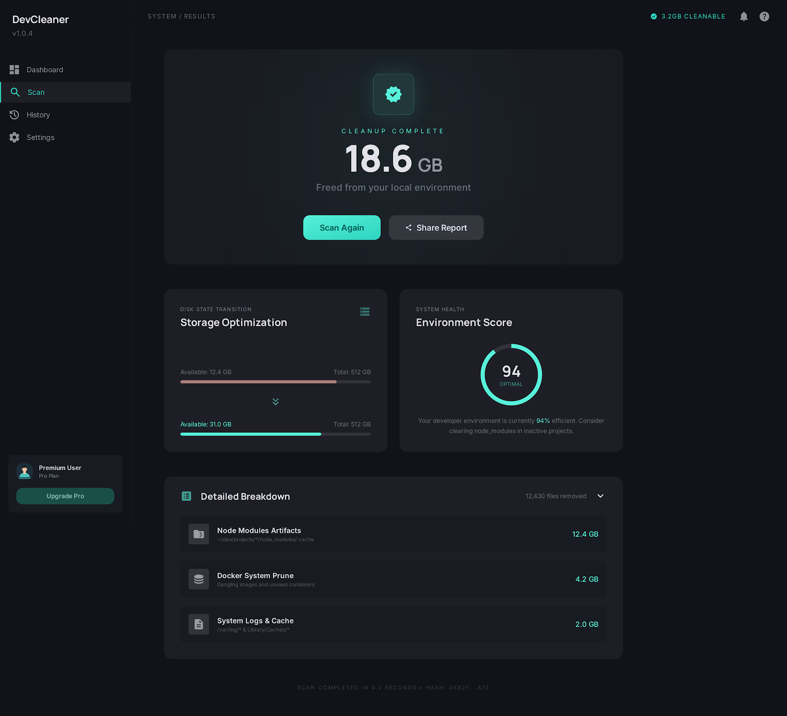

<div align="center">

# Purgr

**AI-powered developer storage cleaner for Windows, macOS & Linux**

[](LICENSE)
[]()
[](CONTRIBUTING.md)
[](https://tauri.app)
[](https://python.org)
[](https://typescriptlang.org)

<br/>

> Purgr scans your developer directories, identifies stale and unused storage,
> and gives you AI-powered, confidence-scored cleanup recommendations —
> all locally, with zero telemetry.

<br/>

[Download](#installation) · [Features](#features) · [Tech Stack](#tech-stack) · [Contributing](#contributing) · [Roadmap](#roadmap)

</div>

---

## Screenshots

| Dashboard | Scan In Progress |
|-----------|------------------|
|  |  |

| Scan Results | Settings |
|--------------|----------|
|  |  |

| Delete Confirmation | Cleanup Success |
|---------------------|-----------------|
|  |  |

---

## The Problem

Developer machines silently accumulate 5–50 GB of hidden storage across:

- **VS Code** — extension caches, logs, workspace storage
- **Android SDK** — old system images, unused platform versions, Gradle caches
- **Python** — pip caches, `__pycache__`, unused virtualenvs, PyTorch binaries
- **Node.js** — npm cache, dead `node_modules` from old projects

Existing tools (CCleaner, Storage Sense) have zero awareness of developer environments. Purgr is built specifically for developers.

---

## Features

-  **Smart scanning** — parallel filesystem walker across all 4 major dev tool ecosystems
- **AI-powered advisor** — natural language explanations for every recommendation
- **Safety classification** — every item scored Safe / Optional / Critical
- **Visual storage breakdown** — donut chart, size bars, per-tool breakdown
- **Natural language queries** — type *"show Android files older than 1 year"*
- **Pattern memory** — learns from your past deletion choices
- **100% local AI** — Ollama runs on your machine, no data leaves
- **Deletion audit log** — every deletion recorded in local SQLite
- **Cross-platform** — Windows, macOS, Linux, single codebase

---

## How It Works

Purgr uses a **multi-signal scoring model** (0–100) to classify each storage item:

| Signal | Max Score | Description |
|--------|-----------|-------------|
| File age | 35 pts | Days since last `mtime` modification |
| Pattern match | 95 pts | Known-safe paths (pip cache, npm cache, etc.) |
| Version obsolescence | 30 pts | Old sibling version detected (android-30 vs android-34) |
| Project activity | 20 pts | Parent project has had no recent activity |
| Process reference | 15 pts | No running process holds a handle to this directory |

**Classification thresholds:**

| Score | Classification | Action |
|-------|---------------|--------|
| 80–100 | ✅ Safe | Recommended for deletion |
| 40–79 | ⚠️ Optional | User decides, AI explains |
| 0–39 | ❌ Critical | Never delete, always blocked |

---

## Tech Stack

### Desktop Shell

| Technology | Version | Purpose |
|------------|---------|---------|
| [Tauri](https://tauri.app) | 2.x | Desktop shell (Rust + native WebView) |
| [SolidJS](https://solidjs.com) | 1.x | Frontend UI (fine-grained reactivity, no virtual DOM) |
| [TypeScript](https://typescriptlang.org) | 5.x | Strict type safety throughout |
| [Vite](https://vitejs.dev) | 5.x | Build tool and dev server |
| [UnoCSS](https://unocss.dev) | latest | Atomic CSS, on-demand, faster than Tailwind |
| [Kobalte](https://kobalte.dev) | latest | Headless accessible UI components for SolidJS |
| [TanStack Query](https://tanstack.com/query) | 5.x | Async server state management |
| [Nanostores](https://github.com/nanostores/nanostores) | latest | Global UI state (framework-agnostic, tiny) |
| [Zod](https://zod.dev) | 3.x | Runtime validation of all IPC responses |
| [@solidjs/router](https://github.com/solidjs/solid-router) | latest | Client-side routing |
| [Lucide Solid](https://lucide.dev) | latest | Icon library |

### Python Core Engine

| Technology | Version | Purpose |
|------------|---------|---------|
| [Python](https://python.org) | 3.12 | Core engine runtime |
| [FastAPI](https://fastapi.tiangolo.com) | 0.111+ | Async REST API (sidecar subprocess) |
| [Pydantic v2](https://docs.pydantic.dev) | 2.x | Strict data validation, no silent coercion |
| [SQLModel](https://sqlmodel.tiangolo.com) | latest | ORM built on SQLAlchemy 2 + Pydantic |
| [Alembic](https://alembic.sqlalchemy.org) | latest | Database migrations |
| [psutil](https://psutil.readthedocs.io) | 6.x | Cross-platform process inspection |
| [litellm](https://litellm.ai) | latest | Local Ollama integration and future provider abstraction |
| [structlog](https://structlog.org) | latest | Structured JSON logging |
| [Dynaconf](https://dynaconf.com) | latest | Environment-aware configuration |
| [anyio](https://anyio.readthedocs.io) | latest | Async backend abstraction |

### AI Layer

| Provider | Type | Status | Notes |
|----------|------|--------|-------|
| [Ollama](https://ollama.com) | Local (default) | Implemented | Recommended local runtime via `DEVSWEEP_OLLAMA_BASE_URL` |
| Additional providers via litellm | Optional | Planned | The codebase is structured to expand beyond Ollama later |

### Rust (Tauri Shell)

| Technology | Purpose |
|------------|---------|
| [Tauri 2](https://tauri.app) | App shell, IPC bridge, sidecar management |
| [tracing](https://docs.rs/tracing) | Structured logging |
| Tauri Updater Plugin | Auto-update mechanism |

### Dev Tooling & Quality

| Tool | Purpose |
|------|---------|
| [Ruff](https://docs.astral.sh/ruff) | Python formatter + linter (replaces black, flake8, isort) |
| [mypy strict](https://mypy-lang.org) | Python static type checking, no `Any` allowed |
| [Prettier](https://prettier.io) | TypeScript/SolidJS formatter, enforced on commit |
| [ESLint](https://eslint.org) | TypeScript linting, strict mode |
| [Husky](https://typicode.github.io/husky) | Git pre-commit hooks |
| [lint-staged](https://github.com/lint-staged/lint-staged) | Run formatters only on staged files |
| [pytest](https://pytest.org) | Unit + integration tests |
| [pytest-asyncio](https://github.com/pytest-dev/pytest-asyncio) | Async test support |
| [Hypothesis](https://hypothesis.works) | Property-based testing for scorer |
| [taskipy](https://github.com/taskipy/taskipy) | Python task runner for backend checks |
| [PyInstaller](https://pyinstaller.org) | Bundle Python sidecar into standalone binary |
| [GitHub Actions](https://github.com/features/actions) | CI on all 3 platforms + auto release |

---

## Project Structure

```
Purgr/
├── packages/
│   ├── core/                        # Python engine and FastAPI sidecar
│   │   ├── devsweep/
│   │   │   ├── scanner/
│   │   │   ├── signals/
│   │   │   ├── scorer/
│   │   │   ├── rules/
│   │   │   ├── ai/
│   │   │   ├── api/
│   │   │   ├── db/
│   │   │   └── config/
│   │   ├── tests/
│   │   │   ├── unit/
│   │   │   └── integration/
│   │   └── pyproject.toml
│   └── desktop/                     # SolidJS frontend + Tauri shell
│       ├── src/
│       │   ├── routes/
│       │   ├── stores/
│       │   ├── ui/
│       │   ├── lib/
│       │   └── app.tsx
│       ├── src-tauri/
│       │   └── src/
│       │       └── main.rs
│       └── package.json
└── .github/
    ├── ISSUE_TEMPLATE/
    ├── workflows/
    └── pull_request_template.md
```

---

## Installation

### Download Binary (Recommended)

Download the latest release for your OS from the [Releases](https://github.com/Sachinsen7/Purgr/releases) page:

- **Windows** — `Purgr_x.x.x_x64-setup.exe`
- **macOS** — `Purgr_x.x.x_x64.dmg`
- **Linux** — `Purgr_x.x.x_amd64.AppImage`

### AI Setup (Optional but Recommended)

For local AI (free, private, offline):

```bash
# Install Ollama
curl -fsSL https://ollama.com/install.sh | sh

# Pull a model
ollama pull llama3.2
```

For the current local AI integration, you can point DevSweep at a custom
Ollama endpoint:

```bash
export DEVSWEEP_OLLAMA_BASE_URL=http://localhost:11434
export DEVSWEEP_AI_MODEL=llama3.2
```

---

## Build From Source

### Prerequisites

- [Node.js](https://nodejs.org) 18+
- [Rust](https://rustup.rs) (latest stable)
- [Python](https://python.org) 3.12+
### Setup

#### Python backend

```powershell
git clone https://github.com/Sachinsen7/Purgr.git
cd Purgr\packages\core
python -m venv .venv
.venv\Scripts\activate
pip install -e .[dev]
python -m devsweep.api
```

The backend starts on `http://127.0.0.1:9231`.

### Deploy the backend

For container and cloud deployment steps, see [packages/core/DEPLOYMENT.md](packages/core/DEPLOYMENT.md).

#### Web preview

```powershell
cd ..\desktop
npm install
npm run dev
```

#### Full desktop app

```powershell
cd packages\desktop

npm run tauri:dev
```

### Individual Tasks

```powershell
cd packages\core
pytest
ruff format .
ruff check .

cd ..\desktop
npm run build
npm run tauri:build
```

---

## Contributing

We welcome contributions — especially new tool rule files!

### Adding support for a new dev tool

No Python knowledge needed — just add a YAML file to
`packages/core/devsweep/rules/`:

```yaml
name: "JetBrains IDEs"
version: "1.0"
paths:
  windows: "%APPDATA%/JetBrains"
  macos: "~/Library/Application Support/JetBrains"
  linux: "~/.config/JetBrains"
patterns:
  - pattern: "*/caches/**"
    classification: safe
    reason: "IDE index caches, rebuilt automatically on next launch"
  - pattern: "*/plugins/**"
    classification: optional
    reason: "Installed plugins, reinstallable from marketplace"
```

See [CONTRIBUTING.md](CONTRIBUTING.md) for the full guide.

### Development Workflow

```bash
git checkout -b feat/your-feature
# make changes
cd packages/core
python -m taskipy lint
python -m taskipy test
git commit -m "feat: your feature"
gh pr create
```

---

## Roadmap

- [x] Core scanner engine (VS Code, Android SDK, Python, Node.js)
- [x] Multi-signal scoring model
- [x] YAML rule system
- [x] SQLite audit log
- [x] Tauri desktop UI shell
- [x] FastAPI sidecar integration
- [x] Initial AI advisor via Ollama
- [ ] Natural language query filter
- [ ] Pattern memory (learn from past deletions)
- [ ] JetBrains IDE support
- [ ] Docker volume cleanup
- [ ] Scheduled background scans
- [ ] CLI standalone mode
- [ ] Plugin SDK for community tool rules

---

## Code Quality Standards

- **Python** — mypy strict, Ruff formatter, no `Any`, no `print()`, structlog only
- **TypeScript** — strict mode, no `any`, no `as` casting, Prettier enforced
- **Tests** — pytest unit + integration + Hypothesis property tests
- **Comments** — zero code comments, self-documenting names only
- **File size** — max 200 lines per file, split into modules if longer
- **Separation** — scanner knows nothing about scorer, scorer knows nothing about AI

---

## Security

Purgr has filesystem access — security is taken seriously.

- No file is ever deleted without explicit user confirmation
- Every deletion is recorded in a local audit log (SQLite)
- All AI runs locally via Ollama by default — no data leaves your machine
- Cloud AI providers are opt-in only, requiring an explicit API key
- No analytics, no telemetry, no tracking of any kind

To report a vulnerability, see [SECURITY.md](SECURITY.md).

---

## Community

- [Code of Conduct](CODE_OF_CONDUCT.md)
- [Contributing Guide](CONTRIBUTING.md)
- [Security Policy](SECURITY.md)
- [License](LICENSE)

---

## License

MIT — free forever. See [LICENSE](LICENSE).

---

<div align="center">

Built with ❤️ for developers who hate mystery gigabytes

⭐ Star this repo if Purgr saved you storage!

</div>
